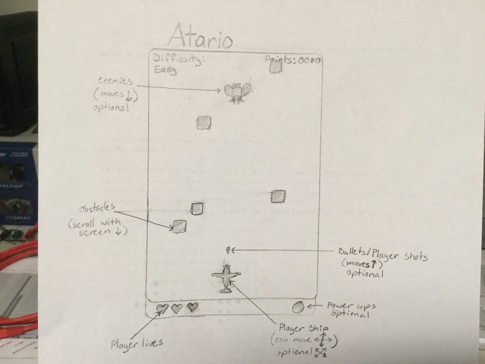

# Atario

## Summary

This program aims to create a Top-Down scroller in which you fly a plane around obstacles.
You move with either the arrow keys or WASD. We plan to implement custom controls if possible.
Scoring would either be through a traditional scoring system, or a longest time.
We also want to add in enemies if possible, which also means that your ship could shoot.
The interface will be made in PyQt to look like a native windows app.

## Features

### Initial Features

* __Movement__- This means the ship can move in cardinal directions.
The also means that the game loop works.

* __Obstacles__- There will be randomly spawned obstacles that the ship will need to avoid.
If you hit one you will lose some of your life, culminating in a game over.

### Optional Features

* Enemies
* Ship Fire
* Movement in Diagonals
* Power-Ups
* Difficulty

## Interface

## Implementation

### Ship Class

#### Variables
* Picture- The Image loaded for the Ship
* Lives- Number of Lives left; Default is 3
* Size- The Size of the ship in terms of pixels
* Location- Pacement of the Ship on the screen in terms of pixels

#### Methods
* Move- Allow direction movement via key presses

### Obstacle Class

#### Variables
* Location- Placement of the Obstacle
* Picture- The Image loaded for the obstacle

#### Methods
* Move- Controls the object as it moves toward the end of the screen

### Game Class

#### Variables
* User- Name of the User

#### Methods
* find_ship- sets the ship's new location
* set_obst- Creates and places an obstacle
* adj_life- Changes the Ship's life count