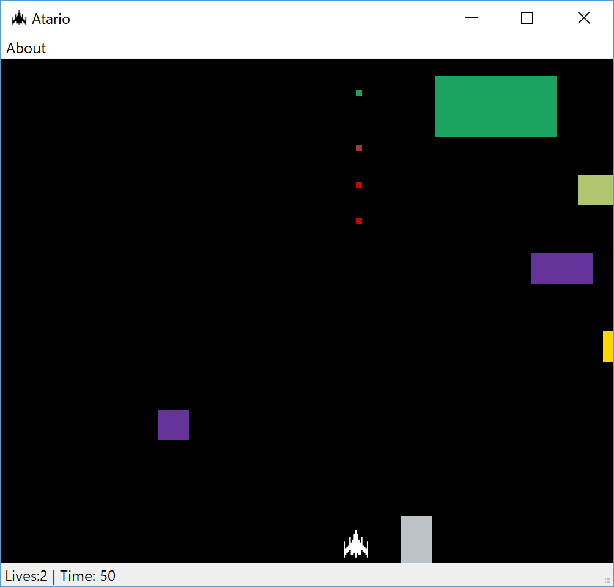

# Atario

## Description
Atario is a top-down action game. The game allows the user to shoot and move around in cardinal directions. As the time goes on the blocks speed up, to add a gradual difficulty. The program was planned to have high scores, but those have sadly not yet been implemented. The goal is the longest survival.

## Features
* WASD or Arrow Keys Controls
* Spacebar to Shoot
* Timekeeping
* Collision
* Live counter

## Requirements
* Python 3.6+
* PyQt5+
* Keyboard
* Mouse

## Installation
1. PC
  To install it on PC you have to:
  * Extract the Zip
  * Run main.py
2. Mac
  To install it on a Mac you have to:
  * Extract the Zip
  * Run main.py
  There have been a few bugs with the Mac version, please send in any problems and we'll get right to fixing it. 
3. Linux
  There has been zero testing done on linux, and thus a version isn't available. 

## How to Use

The first screen will prompt you to click start, do as such.

This leads directly to the main game. The goal was alread mentioned above. The controls for the game are either WASD or the Arrow Keys for movement. The spacebar is for shooting bullets. 

The Game ends when the user has zero lives, then this screen appears

